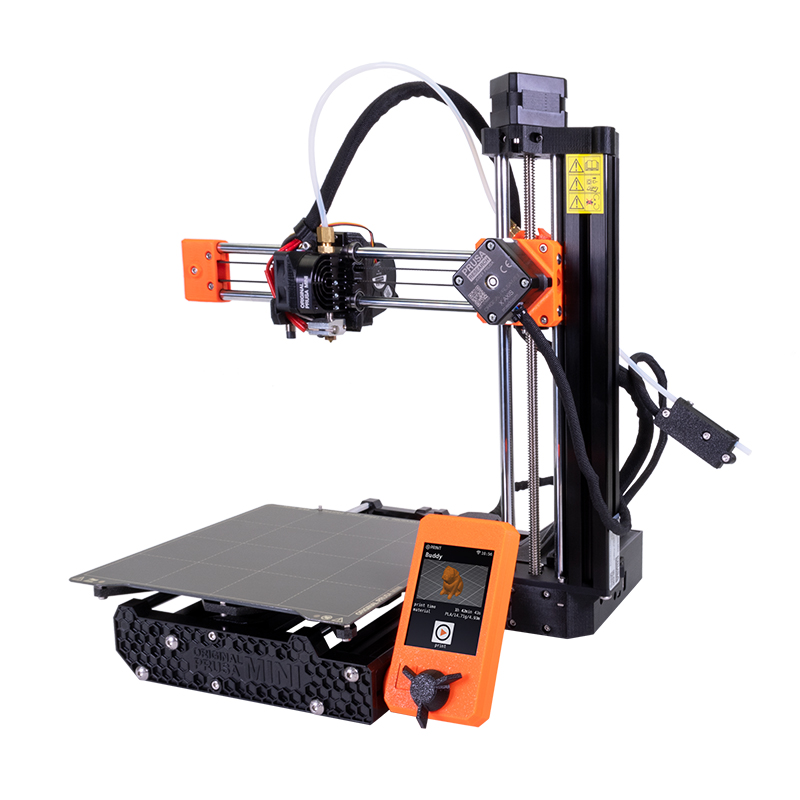

# Prusa Mini+

\
Prusa Mini

## Useful Links 

[​​PrusaSlicer Manual](https://help.prusa3d.com/en/article/first-print-with-prusaslicer_1753)&#x20;

[Service Manuals](https://help.prusa3d.com/en/tag/mini-2/)

## How to Print 

Please refer to the [How to Print](https://app.gitbook.com/o/-LmtnbDJj_0DicA61Vpp/s/-LmtjMpkq7lmFcCnBcpE/~/changes/x3cB2oeEcfRTQ9ZS71Wl/3d-printers/how-to-print) guide for detailed instructions

## Slicer Setup 

1. Open PrusaSlicer on the print computer
2. Make sure the "Printer is set to Original Prusa MINI & MINI+"
   1. .png>)

## Technical Specs 

#### _To be determined_ 
