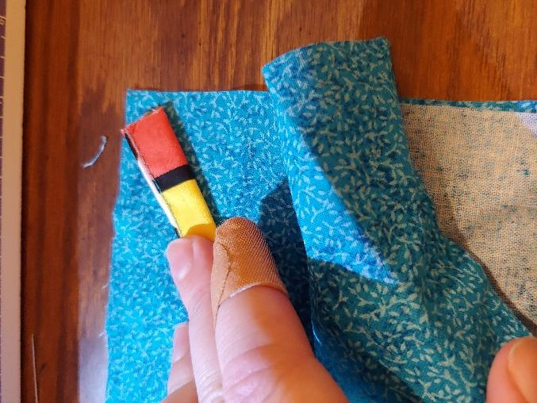

# Midwest Mask

## Mask Requests

Does your organization have a need for reusable cloth masks?

Please fill out the form below and we'll do our best to get you the masks you need.

Our supply is constantly in flux and dependent on local volunteers making them.

There is no guarantee you will receive them by signing up. We will do our best and will contact you to arrange delivery if we have enough on hand to donate.

[Mask Request Form](https://docs.google.com/forms/d/e/1FAIpQLSd4ZRjCT11ue2HLUsixIadBMptkuXtzpHWXqZMkVfGbQv8kvg/viewform?usp=sf_link)

## Overview

The Midwest Mask is a variation on the [Deaconess design](https://www.deaconess.com/How-to-make-a-Face-Mask) by Deaconess Hospital in Evansville, IN. We chose to modify the pattern with an emphasis on the ability to be sterilized and re-used as needed. To accomplish this, we suggest cloth ties as opposed to elastic.

The design and assembly are straightforward and can be made using readily available materials: 100% tightly woven cotton or NWPP \(non-woven polypropylene\), which is used in surgical grade masks and reusable shopping bags. OLY\*fun fabric is a good NWPP fabric with the same density as that used in surgical masks \(25 gsm\).

The mask is able to withstand the high temperatures of being boiled or autoclaved in order to be fully sterilized.

Please include the printed form found under Packaging Instructions with each mask.

These masks are purely meant as a way to reduce the spread of airborne pathogens and is not guaranteed or rated in any way to prevent infection.

## Assembly

### Overview

[Printable Instructions Available Here](https://drive.google.com/file/d/1ukfH8wKdKXp9abZJC_FFVxrq1VGjvsKY/view?usp=sharing) \(5 page Google Doc\)

\*\*\*\*

### **Materials**

**You can make this pattern using entirely cotton fabric, entirely NWPP \(non-woven polypropylene, such as OLY\*FUN or that used in reusable shopping bags**[\[1\]](midwest-mask.md#footnotes)**\), or a mix of both.**

**Main Fabric:** cut 2 rectangles: 6” by 9”

100% cotton \(prewashed and dried for shrinkage\) _OR NWPP_

**Strap Fabric:** 4 straps, each 16"-18" in length

100% cotton sewn using the instructions below _OR use 100% cotton twill tape OR bias tape OR use NWPP folded in half and sewn down the side._

_I_[_nformation on why we don't suggest elastic ties here._](midwest-mask.md#elastic)\_\_

### **Strap Instructions**

**If you are using twill tape, skip this step. If you are using NWPP for the straps, do not iron! Just cut a 1/2"-1" wide strip, fold in half, and sew it down the side. NWPP does not fray at the edges like cotton. If you are using bias tape, just sew it closed up the side as well.**

Cut 2” wide strips of fabric for the straps[ \[2\]](midwest-mask.md#footnotes). Cut them as long as possible; you can shorten them later.

If you are familiar with making bias tape, this is the same process, with the only notable difference being that your strips do not need to be cut on the bias. Fold the long edges of the strap inward towards the middle, creating a windowpane fold. Iron down.

     

Fold in half again along the center and iron.

Sew along the edge to secure the fold.

Cut to 16”-18” in length. [\[3\]](midwest-mask.md#footnotes)

### **Mask Instructions**

**sewing machine required, pins optional**

Stack the two 6” by 9” rectangles right sides together. [\[4\]](midwest-mask.md#footnotes)

Sew along the top starting about 2” from the corner. Insert the end of one strap in the corner and sew in place. As long as it’s secured, you’re good. We’re looking for efficiency and effectiveness, not beauty.

    

Continue sewing along the edge, inserting straps into each corner. All straps should be in between the two rectangles \(like a pillow\). Stop sewing when you have about a 2” wide gap left at the top.

    

Turn the mask right side out. Sew up the little gap that’s left open.

Form three pleats on each edge and pin in place. [\[5\]](midwest-mask.md#footnotes) It doesn’t matter if they go up or down, but both sides must go the same way.

Sew \(topstitch\) around the whole mask once more to secure pleats and seal.

   

### Packaging Instructions

Once assembled, please do a final wash and dry cycle on high heat to begin the sterilization process.

Print and fill [this form](https://drive.google.com/file/d/1fXmhSVE7Mpc0MfD9XOfmKfG8CWuWmlIb/view?usp=sharing) to include with each mask \(6 per page\). 

Once done, immediately put each mask into its own ziplock bag with a filled out information sheet and set aside for drop-off. This will keep the mask as clean and germ-free as possible during transportation and delivery to the end user.

Make more masks!!

## Delivery

 For drop-off locations in Peoria and Morton, contact info@rivercitylabs.space.

### East Peoria

Masks can be dropped off at 2114 Fondulac Dr, East Peoria IL 61611. There is a clear tote on the front porch.

### Pekin

Masks can be dropped off at a dropbox located in front of Facet Computers in Pekin \(next to ValuCheck and Ace Hardware\) from 9-5 Monday-Friday. Look for a black and yellow tote.

## Footnotes

\[1\] NWPP is the fabric I prefer, but cotton is much more abundantly found. Surgical masks are made from NWPP that is the same density as OLY\*fun \(25 gsm\), and are shown to be much more effective at filtration. As for cotton, two layers appears to be the ideal amount as shown by some research studies conducted by Cambridge University in 2009. As for the NWPP, I cannot find evidence that suggests increasing the number of layers past two has any discernable effect on filtration or waterproofing, but rather makes breathing more difficult and sewing the pleats is a nightmare and a half. If you have found evidence to the contrary, please contact me \(pr@rivercitylabs.space\)!

\[2\] A rotary cutter is helpful here. Also helpful to note that cotton will rip along the weave in a straight line—simply measure and make small cuts and rip away.

\[3\] Ideally, 18”, but optimize the usage of your scrap cotton.

\[4\] NWPP doesn’t have sides but cotton does.

\[5\] Alternatively, you can form the pleats as you sew.

## Why don't we suggest sewing straps from elastic? 

Most patterns suggest sewing straps from elastic for DIY face masks. While I absolutely agree that elastic is more comfortable and easier to sew than the cotton straps, it's not quite as hardy when it comes to sterilization, and right now it's very hard to source! If you have elastic you would like to use, please make sure it's latex free \(sometimes hard to tell\), and know that it may not be able to be reused. Thanks!

## Justification

[The CDC acknowledges there are situations where these masks will be a viable option when all other options are exhausted/unavailable in a crisis/shortage](https://www.cdc.gov/coronavirus/2019-ncov/hcp/respirators-strategy/crisis-alternate-strategies.html)

[Actual testing showing diy masks can offer some protection](https://smartairfilters.com/en/blog/diy-homemade-mask-protect-virus-coronavirus/)

[Actual testing that shows diy mask materials can be effective and better than no mask](https://smartairfilters.com/en/blog/best-materials-make-diy-face-mask-virus/?fbclid=IwAR0xb7giemOM-f0OmPE_g7DyBizqYqT85ndlod4KXE6XcEpLF2eBqPJd_Wk)

[Scientific study that found Surgical masks are as good as N95 respirators for the purpose of preventing flu and respiratory virus prevention](https://www.sciencedaily.com/releases/2019/09/190903134732.htm)

