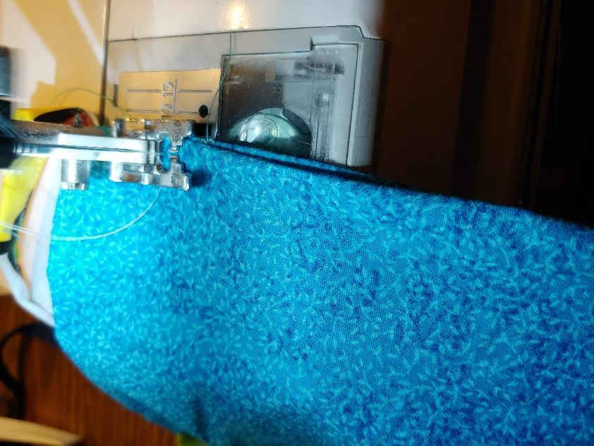

# Midwest Mask

## Mask Requests

Does your organization have a need for masks?

Please fill out the form below and we'll do our best to get you the masks you need.

Our supply is constantly in flux and dependent on local volunteers making them.

There is no guarantee you will receive them by signing up. We will do our best and will contact you to arrange delivery if we have enough on hand to donate.

[Mask Request Form](https://docs.google.com/forms/d/e/1FAIpQLSd4ZRjCT11ue2HLUsixIadBMptkuXtzpHWXqZMkVfGbQv8kvg/viewform?usp=sf_link)

## Overview

The Midwest Mask is our take on the leading [Deaconess design](https://www.deaconess.com/How-to-make-a-Face-Mask)  by Deaconess Hospital in Evansville, IN but with an emphasis on ease of assembly and the ability to be sterilized and re-used as needed.

This is accomplished by eliminating all elastic \(we use cloth ties\) and simplifying the sewing pattern.

The mask is able to withstand the high temperatures of being boiled or autoclaved in order to fully  sterilize.

These are purely meant as a way to reduce the spread of airborne pathogens and is not guaranteed or rated in any way to prevent anything from happening to the user.

## Assembly

### Overview

\*\*\*\*

### **Materials**

**Main Fabric:** cut 2 rectangles: 6” by 9”

100% cotton \(prewashed and dried for shrinkage\) OR non-woven polypropylene \(NWPP\) \(such as OLY\*FUN, or that used for reusable shopping bags\).[\[1\]](https://wiki.rivercitylabs.space/covid-19/midwest-mask#footnotes)

**Strap Fabric:** 100% cotton--sewn straps OR use 100% cotton twill tape or bias tape. \(Four 16-18” straps per mask.\)

Cut 2” wide strips of fabric for the straps[\[2\]](https://wiki.rivercitylabs.space/covid-19/midwest-mask#footnotes). Cut them as long as possible; you can shorten them later.

### **Strap Instructions**

If you are familiar with making bias tape, this is the same process, with the only notable difference being that your strips do not need to be cut on the bias. Fold the long edges of the strap inward towards the middle, creating a windowpane fold. Iron down.

     

Fold in half again along the center and iron.

Sew along the edge to secure the fold.

Cut to 16”-18” in length.[\[3\]](https://wiki.rivercitylabs.space/covid-19/midwest-mask#footnotes)

### **Mask Instructions**

**sewing machine required, pins optional**

Stack the two 6” by 9” rectangles right sides together.[\[4\]](https://wiki.rivercitylabs.space/covid-19/midwest-mask#footnotes)

Sew along the top starting about 2” from the corner. Insert the end of one strap in the corner and sew in place. As long as it’s secured, you’re good. We’re looking for efficiency and effectiveness, not beauty.

    

Continue sewing along the edge, inserting straps into each corner. All straps should be in between the two rectangles \(like a pillow\). Stop sewing when you have about a 2” wide gap left at the top.

    

Turn the mask right side out. Sew up the little gap that’s left open.

Form three pleats on each edge and pin in place.[\[5\]](https://wiki.rivercitylabs.space/covid-19/midwest-mask#footnotes) It doesn’t matter if they go up or down, but both sides must go the same way.

Sew around the whole thing to secure.

   

Make more masks!!

## Footnotes

\[1\] NWPP is the fabric I prefer, but cotton is much more abundantly found. Surgical masks are made from NWPP that is the same density as OLY\*FUN \(25 gsm\), and are shown to be much more effective at filtration. As for cotton, two layers appears to be the ideal amount as shown by some research studies conducted by Cambridge University in 2009. As for the NWPP, I cannot find evidence that suggests increasing the number of layers past two has any discernable effect on filtration or waterproofing, but rather makes breathing more difficult and sewing the pleats is a nightmare and a half. If you have found evidence to the contrary, please contact me \(pr@rivercitylabs.space\)!

\[2\] A rotary cutter is helpful here. Also helpful to note that cotton will rip along the weave in a straight line—simply measure and make small cuts and rip away.

\[3\] Ideally, 18”, but optimize the usage of your scrap cotton.

\[4\] NWPP doesn’t have sides but cotton does.

\[5\] Alternatively, you can form the pleats as you sew.

## Justification

[The CDC acknowledges there are situations where these masks will be a viable option when all other options are exhausted/unavailable in a crisis/shortage](https://www.cdc.gov/coronavirus/2019-ncov/hcp/respirators-strategy/crisis-alternate-strategies.html)

[Actual testing showing diy masks can offer some protection](https://smartairfilters.com/en/blog/diy-homemade-mask-protect-virus-coronavirus/)

[Actual testing that shows diy mask materials can be effective and better than no mask](https://smartairfilters.com/en/blog/best-materials-make-diy-face-mask-virus/?fbclid=IwAR0xb7giemOM-f0OmPE_g7DyBizqYqT85ndlod4KXE6XcEpLF2eBqPJd_Wk)

[Scientific study that found Surgical masks are as good as N95 respirators for the purpose of preventing flu and respiratory virus prevention](https://www.sciencedaily.com/releases/2019/09/190903134732.htm)

