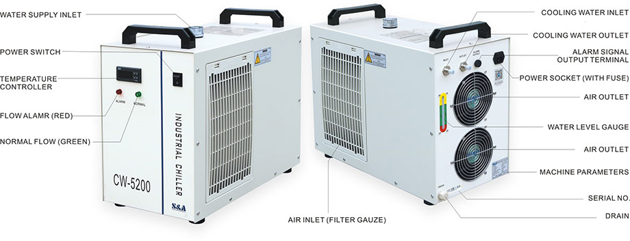

# Chiller

_**Periodic Maintenance**   
  
- the air_ inlet filters on the left and right side of the chiller need to be cleaned monthly or when they appear dirty. The radiator inside the chiller behind the rear air outlet exhaust fans must also be cleaned monthly. This can be accomplished by using the compressor to blow out the inside of the chiller.  
  
- The coolant level needs to be checked weekly or before each use. 

There is a 10A 250V fast acting fuse inside the power socket on the back of the unit. There is a spare fuse in the socket as well.

## Useful Links

[Manual](https://drive.google.com/file/d/1Jof2Do8vmVJm1ZrZEwuOgQ0B-mArA3jt/view?usp=sharing)

[Quick Start Guide](https://drive.google.com/open?id=19k9Gs7ne4wrSUq2_x1pxwlwmF7vBXS7R)

[Chiller Setup](https://youtu.be/w0soQMapbIU)

[Coolant Recipe](https://lasergods.com/laser-water-coolants-additives/#The_Secret_Recipe)

