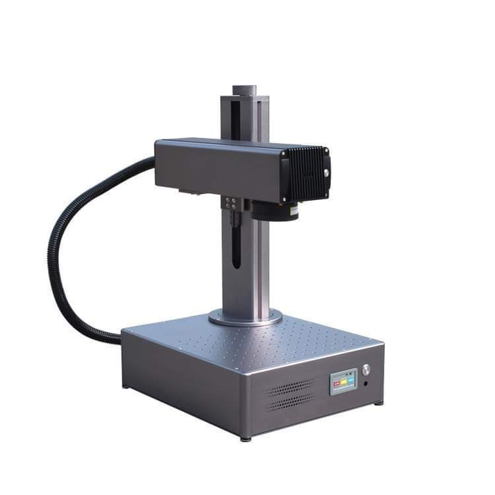

# Fiber Laser

<figure><figcaption></figcaption></figure>

## Get Trained before you can Operate

Hope you have read through this wiki guide and are familiar with the overall machine and its operation.

Get hold of one of members in our [laser channel in slack](https://app.slack.com/client/T046HEHJB/CRU0MGM1P) to get your hands on the machine.

## How to transfer your files

### from RCL Desktop

* #### Desktop PC has a mopped drive to the FIBERLASER PC where you can use/transfer files to the FIBERLASER PC
* #### files can be any lightburn supported files extensions .
