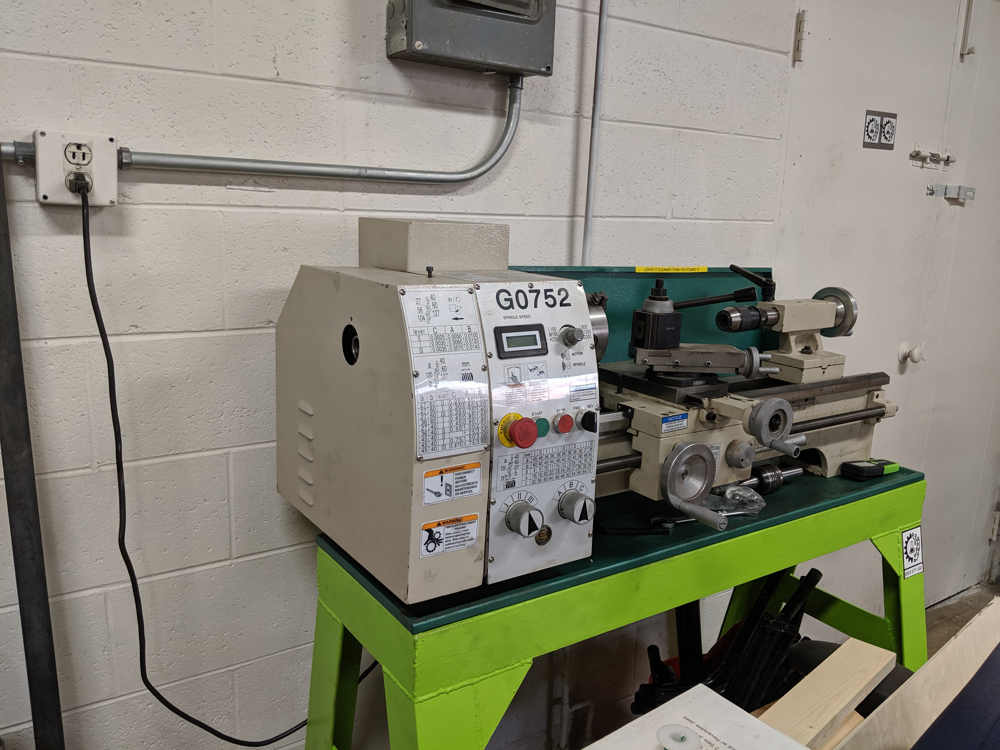

# Lathe

## Useful Links

[User Manual ](https://drive.google.com/a/rivercitylabs.space/file/d/1NW3wUazLC2XaAQLUS4HTpMSV0BHnNHsF/view?usp=sharing)

[Machine Data Sheet](https://drive.google.com/open?id=1pwmuwi-BoVfaca1pkJiMJaC-k12RQ_lX) 

[Parts List](https://drive.google.com/open?id=1gSkSVf52DhdgFJRLMGQ4Qx1_fKQSGOi0)

## Guides

[Indicating Square Stock in a 4 Jaw Chuck](https://www.youtube.com/watch?v=aA0suYN72SE)

[Lathe Chucks \(This Old Tony\)](https://www.youtube.com/watch?v=K67bZQSETiE)

[A Brief Chat about Carbide Tooling \(This Old Tony\)](https://www.youtube.com/watch?v=rsFFWYo8ugw)

