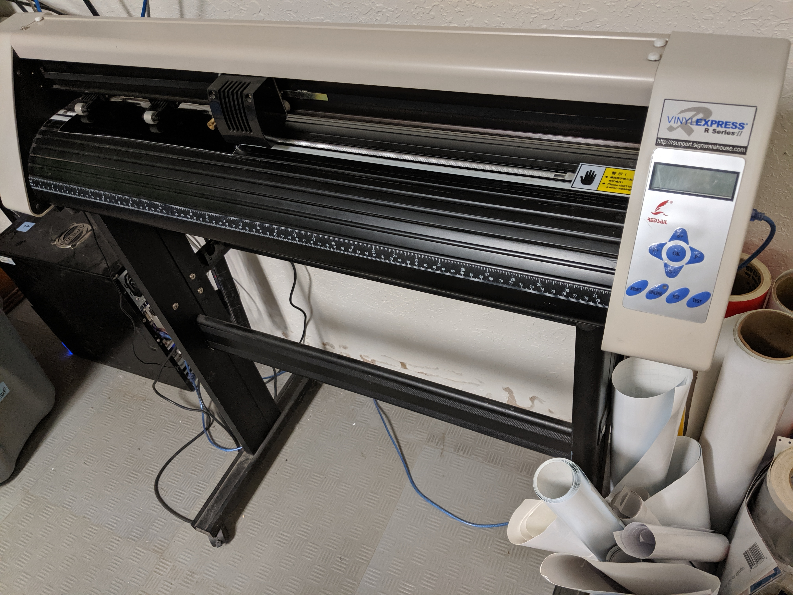

# Vinyl Cutter - Redsail

## Useful Links

[Manual](https://drive.google.com/open?id=12Fksn53m9qx8DPYEIUvpSVd3hyfBDd6_)

[Redsail site](http://www.hflaser.com/Vinyl-Cutter.html)

[Cutter Blade Reference Guide](http://support.rolanddga.com/Docs/Documents/departments/Technical%20Services/Downloads/CutStudio/Cutter%20Blade%20Reference%20Guide.pdf)

## Software

We use [Sure Cuts a Lot](http://www.surecutsalot.com/index.php) on the computer near the vinyl cutter to create designs and send them to the cutter.

[Here](http://www.surecutsalot.com/tutorials/tutorials.php) are some tutorials on how to use it.

## Usage Instructions

Remove fabric cover and turn the vinyl cutter on using the power switch located on the side of the machine.

#### Loading Material

Load your vinyl into the machine. The rack on the back of the machine holds your roll of vinyl. There are three clips on the machine itself that hold vinyl in place on the rollers--flip them up to feed your piece of vinyl into the rollers, and flip them down to secure the vinyl.

#### Check the Alignment of the Material

Once your vinyl is in place, check the alignment of your material. Press the "Online" button on the cutter controller. Using the arrow keys, feed the vinyl down to check for traveling. You can watch the ruler on the machine to see if your material is traveling side-to-side. This is very important for long cuts. Adjust as needed.

#### Set Origin Point

Set the blade origin using the left and right arrow keys. Most origins start at the furthest right side of the material. When you have the blade at your starting point, press "Set" on the controller, then press "OK."

#### Set Blade Pressure and Speed

Blade pressure and speed will vary depending on the material you wish to cut. A good starting point for Oracal 651 vinyl is 90g pressure and 25mm/s speed. Adjust pressure and speed using the arrow buttons.

Note that cutter must NOT be in "Online" mode in order to set pressure and speed. Otherwise, the arrow keys just move the vinyl and blade.

#### Test Blade Pressure and Speed

Test the pressure and speed by first selecting "Online" on the controller and then pressing the "Test" button. It will cut a .5" \(approx.\) square. Peel back the vinyl to see the cut. If it peels off with no resistance, and the blade didn't cut through your backing paper, you should be set to go.

The pressure and speed you use will vary across materials and also depends on how sharp the blade is. It's always best to just test until you get the ideal cut for your project.

After testing the pressure and speed, return your blade to its origin position and press "OK."

#### Using Sure Cuts a Lot

Open Sure Cuts a Lot 5 on the PC next to the laser cutter.

Note:

1. You have to use this PC as it is hardwired to the vinyl cutter.
2. You have to open Sure Cuts a Lot AFTER turning on the vinyl cutter. I don't know why this is, but it just doesn't recognize the vinyl cutter if you turn it on afterwards.

Load your design in using the import function, or design it inside the software. SVG formats work best for cutting. For more information on Sure Cuts a Lot, go to their [website](http://surecutsalot.com/tutorials/tutorials.php). They have tutorials for in-depth learning.

When you are ready to cut, choose "Cutter" at the top of the program window. Most of the settings should already be set. The only setting you may want to change is the cutting mode.

#### Origin Point vs WYSIWYG Cutting Mode

Origin point cutting mode uses the bottom right corner of your image as the starting point. On the preview in the Cutter menu, you'll see your image aligned to the bottom right corner of the cutting mat. The origin you set your vinyl cutter blade at is where that bottom right corner will be.

WYSIWYG \(What You See Is What You Get\) cutting mode uses the cutting mat workspace in Sure Cuts a Lot as the reference for where to place your design. The origin you set your vinyl cutter blade at will align with the bottom right corner of the preview.

**For most projects, it is easiest to use the Origin Point mode.**

#### Send your design to the cutter to begin cutting. If you need to stop the cut \(especially if the vinyl bunches or gets stuck\), press the "Stop" or "Pause" button on the computer.

## Specifications

| Model | RS720C | RS800C | RS1120C | RS1360C |
| :--- | :--- | :--- | :--- | :--- |
| Control system | Risc micro-controller |  |  |  |
| Drive type | Stepper motor |  |  |  |
| Media Size \(mm\) | 720 | 800 | 1120 | 1360 |
| Cutting size \(mm\) | 620 | 700 | 1000 | 1200 |
| Cutting speed | 600 mm/s |  |  |  |
| Cutting force | 10-500 g |  |  |  |
| Lcd display | English |  |  |  |
| Resolution | 1000 DPI |  |  |  |
| Repeatability\(mm\) | 0.01 |  |  |  |
| Command | HPGL |  |  |  |
| Interface | 232/USB |  |  |  |
| Power | 90~240V / 50~60Hz |  |  |  |

