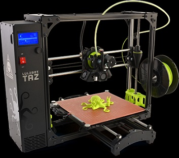

# Radford - Lulzbot TAZ 6

## Useful Links

[Remote Radford Taz 6 Octoprint](https://3dprinter3.rivercitylabs.space) - login info is on the printer

If you cannot reach the Remote Site use [this link](http://192.68.111.201) When in the space to reach the octoprint\
&#xNAN;**(works only when the space connected to the RCL's Wi-Fi)**

[Official TAZ 6 Site](https://www.lulzbot.com/store/printers/lulzbot-taz-6)

## How to Print

Please refer to the [How to Print](../how-to-print.md) guide for detailed instructions

## Slicer Setup

1. Open Cura LE
2. Go to Settings > Printers > Add printer
3. Configure the printer from the "Add Printer" picture below
   1. Follow the green boxes
4. Click Add Printer
5. Accept default Machine Settings

.png>)

## Technical Specs

#### &#x20;Printing

**Print Surface:** Heated borosilicate glass bed covered with PEI print surface. Separate bed preparation is recommended when printing with flexible filaments, which can be found on the Flexystruder and FlexyDually Tool Head pages respectively.

**Print Area:** 280 mm x 280 mm x 250 mm (11.02 in x 11.02 in x 9.8 in)

**Print Volume:** 19,600 cm3 (1,185 in3) of usable space

**Top Print Speed:** 200 mm/sec (7.9 in/sec)

**Average Print Speed:** 30 - 50 mm/sec (1.18 - 1.97in) Using default nGen profile

**Layer Thickness with 0.5 mm nozzle:** 0.050 mm to 0.5 mm (0.002 in - 0.02 in)

**Capable Materials:**

* ABS
* Alloy 910
* Bronze
* Conductive PLA and ABS
* Copper
* HIPS
* Nylon
* PC-ABS
* PCTPE
* PETG
* PETT
* PLA
* Polycarbonate
* Polyester (Tritan)
* PVA
* Stainless steel-filled filaments
* UV luminescent filaments
* Wood filled filaments

**Discouraged Materials:** 3D printing with carbon fiber filaments is not recommended at this time because carbon fiber filaments can degrade both the nozzle and hot end of the LulzBot TAZ 6 Tool Head.

**Usable Filament Sizes:** standard 3 mm (0.1 in)

**Multi-Software Compatible:** Cura LulzBot Edition, OctoPrint, BotQueue, Slic3r, Printrun, MatterControl, and many more.

#### &#x20;Physical Dimensions

**Overall Dimensions:** 66 cm x 52 cm x 52 cm (26 in x 20.47 in x 20.47 in)

**Operating Dimensions:** 82 cm x 63 cm x 52 cm (32.28 in x 24.8 in x 20.47 in)

#### &#x20;Electrical

**Power Requirements:** 100 - 240 VAC

**Power Output:** 24 volt 500 watts 21 amp

**Average Current Draw:** 5.3 Amps (US), 2.65 Amps (EU)

**Maximum Draw:** 625 watts

**Example Power Consumption: ABS**

* 0.239kWh, 30 minute print
* 0.450 kWh, 60 minute print

**Operating Temperature Range**

* Maximum Tool Head Temperature: 300°C (572°F)
* Maximum Heated Bed Temperature: 120°C (248°F) 100 - 240 VAC
