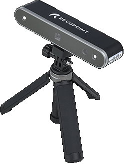

# Fiber Laser

<figure><figcaption></figcaption></figure>

## <mark style="color:red;">Get Trained before you can Operate!!!</mark>

Hope you have read through this wiki guide and are familiar with the overall machine and its operation.

Get hold of one of members in our [laser channel in slack](https://app.slack.com/client/T046HEHJB/CRU0MGM1P) to get your hands on the machine.

## How to transfer your files

### from RCL Desktop

* #### Desktop PC has a mapped drive to the FIBERLASER PC where you can use/transfer files to the FIBERLASER PC
* #### Files can be any LightBurn supported files extensions .

HT-60 Compact Design Fiber Laser\
60W JPT EM7 Mopa compact\
EZCAD2 machine with 500mm\
tower with 4pcs\
lens(110/150/210/300) and 1pcs\
rotary(D100)

<figure><figcaption></figcaption></figure>

