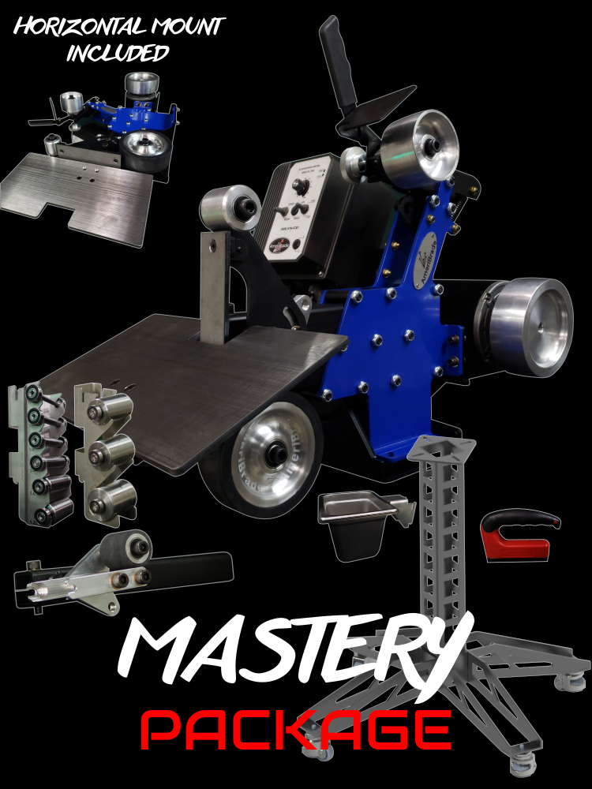

# Ameribrade 2x72 Belt Grinder

The Ameribrade Belt Grinder is in the grinding room

<figure><figcaption></figcaption></figure>

## Specifications

* 7” DRIVE WHEEL
* COMBO TILTING PLATEN ASSEMBLY WITH 6” RUBBER CONTACT WHEEL ON AN ACCESSORY ARM
* LARGE (15.5” X 8”) TILTING WORK REST
* PEDESTAL STAND WITH LEVELING CASTERS
* STAINLESS WATER BUCKET AND HOLDER
* SMALL WHEEL HOLDER WITH ONE DEFLECTOR WHEEL ON AN ACCESSORY ARM
* 9 SMALL WHEELS AND 2 STORAGE RACKS (SMALL WHEEL SIZES: 1/4”, 3/8”, 1/2”, 3/4”, 1”, 1.25”, 1.5”, 1.75”, AND 2”)
* MAGNETIC HANDLE

## Useful Links

[Manual](https://www.ameribrade.com/packages/mastery)

[Product Page](https://www.ameribrade.com/packages/mastery)

