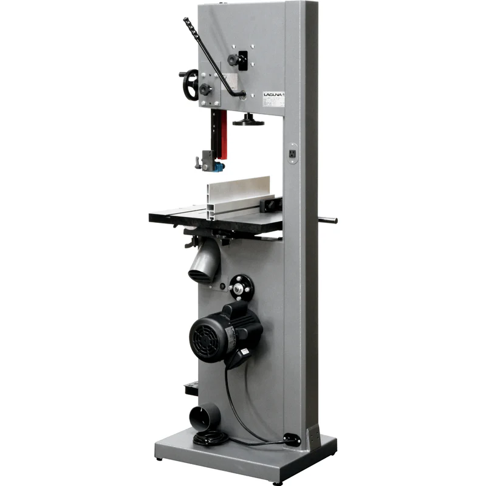

# Laguna 14BX Bandsaw

<figure><figcaption></figcaption></figure>

## Specifications

* Resaw Capacity: 13''
* Overall Height: 70-1/4''
* Table Dimensions: 21-1/2'' x 16''
* Table Height from Floor: 38''
* Table Tilt Right: 45°
* Table Tilt Left: 7°
* Dust Ports: (2) 4''
* Blade Length: 115''
* Max. Blade Width: 3/4''
* Min. Blade Width: 1/8''
* Wheel Material: Cast iron
* Footprint: 17-1/2'' x 22-1/2''
* Voltage: 110V
* Motor: 1.75HP, 14A, TEFC
* Light Outlet Voltage: 110V
* 6' Cord w/ Nema Plug: 5-15P
