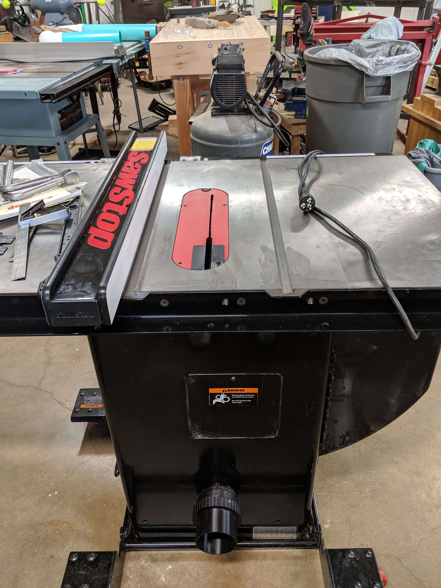

# SawStop

## Miscelanous Info

There is an extension cord for the SawStop. It should be hanging on the wall by the 220 volt outlet.

## Useful Links

[Getting Started](https://drive.google.com/open?id=1uNxufF2D\_sIeUUZ9ADy\_mIctH4-KHZR4)

[Operators Manual](https://drive.google.com/open?id=16iyUeL\_b0hr7jvxnpHpZZdD4g2r0IW9j)

[T-Glide Fence System](https://drive.google.com/open?id=16iyUeL\_b0hr7jvxnpHpZZdD4g2r0IW9j)

[Service Tips and Videos](https://www.sawstop.com/support/service-tips/all-videos)

[SawStop Professional Cabinet Saw (video)](https://youtu.be/ltmL-oQn8NM)

[Replacing your SawStop Cartridge (video)](https://youtu.be/ENVYpuJu5fE)

[SawStop: How It Works (video)](https://youtu.be/T3IGPCkirdU)

[SawStop Additional Safety Features (video)](https://youtu.be/cAbZ1ze6Dbg)

